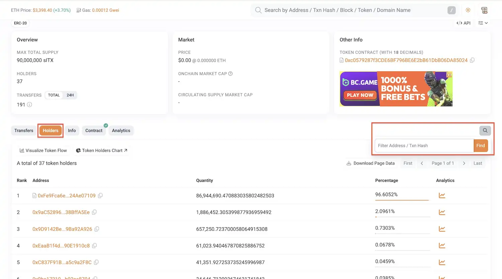
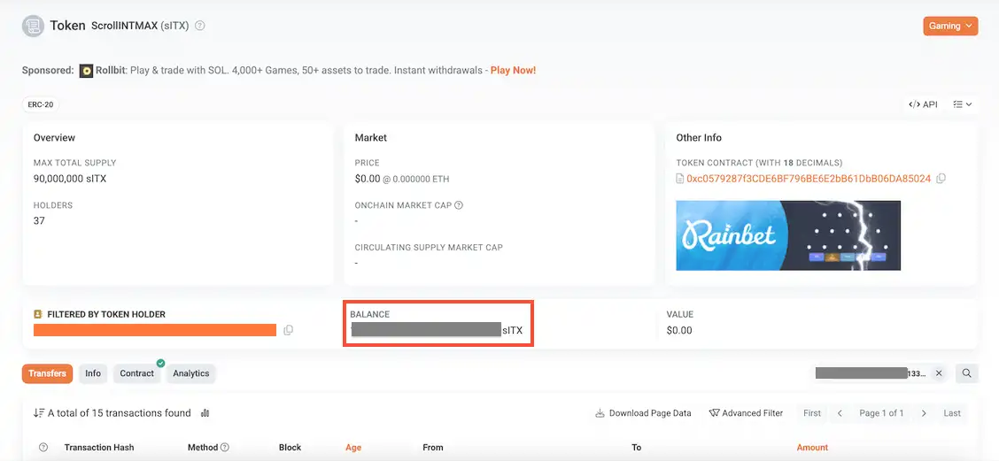

# リワードの受取

## はじめに

このガイドでは、INTMAX Block Builder が獲得したリワードを Claim するための手順を説明します。INTMAX ネットワークの Block Builder 参加者は、2種類のリワードを受け取ることができます。ブロックで処理したトランザクションから収集されるユーザー手数料と、リワードプログラムを通じて配布される ITX トークンです。

このドキュメントでは、初期セットアップからリワードの Claim まで、以下の方法を解説します。

- コマンドラインツールと環境のセットアップ
- Ethereum 秘密鍵（Private Key）から INTMAX キーの生成
- 蓄積された残高の確認とユーザー手数料の Withdrawal
- ブロック生成活動で獲得した ITX トークンリワードの Claim

**注意:** リワードを受け取る際は CLI をクローンしてコマンドを実行する必要がありますが、Block Builder を実行しているサーバー上で行う必要はありません。

**注意:** このオペレーションを実行する環境には、**最低 1 GB のメモリ**が必要です。

## リワードの受取方法

### 準備

コマンドラインツールを使用してリワードを Claim できます。以下は**メインネット**でのリワード Claim 方法の説明です。

```bash
git clone git@github.com:InternetMaximalism/intmax2.git -b main
cd intmax2/cli
```

次に、CLI 用の環境変数を設定します。RPC URL が必要ですので、[Alchemy](https://www.alchemy.com/) や [Infura](https://www.infura.io/) などのプロバイダーでアカウントを作成し、API キーを生成してください。

⚠️ **重要:** `L1_RPC_URL` と `L2_RPC_URL` には、それぞれ Ethereum と Scroll ネットワークの RPC URL を設定してください。

```bash
cat <<EOF > .env
ENV=prod
IS_FASTER_MINING=false
INDEXER_BASE_URL=https://api.indexer.intmax.io
STORE_VAULT_SERVER_BASE_URL=https://api.node.intmax.io/store-vault-server
LOCAL_BACKUP_PATH=data/mainnet
STORE_VAULT_TYPE=remote_with_backup
BALANCE_PROVER_BASE_URL=https://api.private.zkp.intmax.io
USE_PRIVATE_ZKP_SERVER=true
VALIDITY_PROVER_BASE_URL=https://api.node.intmax.io/validity-prover
WITHDRAWAL_SERVER_BASE_URL=https://api.node.intmax.io/withdrawal-server
WALLET_KEY_VAULT_BASE_URL=https://api.keyvault.intmax.io/v1
DEPOSIT_TIMEOUT=180
TX_TIMEOUT=80
BLOCK_BUILDER_QUERY_WAIT_TIME=5
BLOCK_BUILDER_QUERY_INTERVAL=5
BLOCK_BUILDER_QUERY_LIMIT=20
STORE_VAULT_MAX_RPS=5.0
VALIDITY_PROVER_MAX_RPS=5.0
BAD_GATEWAY_RETRY_LIMIT=3
LIQUIDITY_CONTRACT_ADDRESS=0xF65e73aAc9182e353600a916a6c7681F810f79C3
ROLLUP_CONTRACT_ADDRESS=0x1c88459D014e571c332BF9199aD2D35C93219A2e
WITHDRAWAL_CONTRACT_ADDRESS=0x86B06D2604D9A6f9760E8f691F86d5B2a7C9c449
REWARD_CONTRACT_ADDRESS=0xFe9Fca6e5AE58E6F06873D2beFB658424Ae07109
L1_RPC_URL=https://eth-mainnet.g.alchemy.com/v2/your_api_key # !!! CHANGE YOUR API KEY !!!
L2_RPC_URL=https://scroll-mainnet.g.alchemy.com/v2/your_api_key # !!! CHANGE YOUR API KEY !!!
EOF
```

### ユーザー手数料

セットアップ完了後、以下のコマンドをステップごとに実行してください。**intmax2** リポジトリの **cli** ディレクトリ内で実行してください。

⚠️ 注意: `rustup` コマンドがシステムで利用できない場合は、[Rust 公式インストールページ](https://rust-lang.org/tools/install/)の手順に従って Rust と Cargo をインストールしてください。

**Step 0: intmax2 リポジトリの更新**

コマンドを実行する前に、intmax2 リポジトリが最新であることを確認してください。
ターミナルを開き、リポジトリのディレクトリに移動して最新の変更を取得します。

```bash
cd /path/to/intmax2
git pull origin main
```

⚠️ 注意: コマンドを実行する前に、`/path/to/intmax2` を実際のディレクトリパスに置き換えてください。

**Step 1: Scroll の秘密鍵から INTMAX キーを生成**

```bash
cargo run -r -- key-from-backup-key --backup-key <scroll-private-key>
```

想定される出力：

```
Address: i9eW...
View Only Key: viewpair/0x49c1...
Spend Key: 0x9821...
Key Pair: keypair/0x49c1...
```

**:warning: 重要な注意事項**: **View Only Key、Spend Key、Key Pair は絶対に他人と共有しないでください。**
特に Spend Key や Key Pair が他者に知られた場合、INTMAX ネットワーク上のあなたの資産を移動される重大なリスクがあります。

**Step 2: INTMAX 秘密鍵で残高を確認**

**重要:** `<spend-key>` には、Step 1 の出力ログで生成された `0x` で始まる `Private key` をコピー＆ペーストしてください。

```bash
cargo run -r -- balance --private-key <spend-key>
```

> 注意: このコマンドの完了にはかなりの時間がかかる場合があります。過去に大量のブロックを送信している場合、完了までに **24 時間以上**かかることがあります。

コマンド実行中は、以下のようなログが表示されます。ノードの稼働期間が長いほど、表示されるログが多くなります。

```
[2025-10-17T06:00:00Z INFO  intmax2_client_sdk::external_api::local_backup_store_vault::local_store_vault] local_save_data_batch: topic: v1/ra_wo/transfer, pubkey: 0x0e9e...42cf, digest: 0xfb26...d381
[2025-10-17T06:00:00Z INFO  intmax2_client_sdk::external_api::local_backup_store_vault::local_store_vault] local_save_data_batch: topic: v1/ra_wo/transfer, pubkey: 0x0e9e...42cf, digest: 0x5408...fc00
```

> 注意: 以下のような同期ログが表示され続ける場合は、コマンドを安全に停止して後で再実行できます。同期は中断した箇所から再開されます。

```
sync_transfer: MetaDataWithBlockNumber { meta: MetaData { timestamp: 1752000000, digest: 0x951d5ad4 }, block_number: 2000 }
```

残高の同期が完了すると、以下のようなログが表示されます。

```
Balances:
	Token #0:
		Amount: 2342400000000000
		Type: NATIVE
```

以下のログが表示されて実行が停止した場合は、**balance** コマンドを再度実行してください。

```
Client error: Server client error: Invalid response: Failed to read response: reqwest::Error { kind: Decode, source: reqwest::Error { kind: Body, source: TimedOut } }
```

**Step 3: 資金の Withdrawal**

```bash
cargo run -r -- withdrawal --private-key <spend-key> --to <ethereum-address> --amount <amount> --token-index 0
cargo run -r -- sync-withdrawals --private-key <spend-key>
```

> 注意: このコマンドの実行には最低 **2 分**かかる場合があります。

`<scroll-private-key>`、`<spend-key>`、`<ethereum-address>`、`<amount>` などのプレースホルダーは実際の値に置き換えてください。`<amount>` には、残高に表示された値から **35,000,000,000,000 を引いた値**を指定してください。たとえば、残高が **2,342,400,000,000,000 wei** の場合、`2307400000000000`（= 2,342,400,000,000,000 − 35,000,000,000,000）を指定します。

```
cargo run -r -- withdrawal --private-key <spend-key> --to <ethereum-address> --amount 2307400000000000 --token-index 0
```


### ITX トークン

以下のコマンドを実行してリワードを Claim してください。`<scroll-private-key>` を実際の Scroll 秘密鍵に置き換えてください。

```bash
cargo run -r -- claim-builder-reward --eth-private-key <scroll-private-key>
```

コマンドの実行には、Ethereum アドレスに対応する Scroll アドレスにガス代（約 **0.00001 ETH**）を支払うのに十分な ETH が必要です。

**想定されるレスポンス**

Claim 可能なリワードがある場合、以下のような出力ログが表示されます。

```
[2025-06-01T00:00:00Z INFO  intmax2_cli::cli::claim] Claiming block builder reward for user address: 0x...
[2025-06-01T00:00:00Z INFO  intmax2_cli::cli::claim] Current reward period: 3
[2025-06-01T00:00:00Z INFO  intmax2_cli::cli::claim] Claiming block builder reward for period 0: 105365126676602086438152
[2025-06-01T00:00:00Z INFO  intmax2_cli::cli::claim] Claiming block builder reward for period 1: 120149253731343283582089
[2025-06-01T00:00:00Z INFO  intmax2_cli::cli::claim] Claiming block builder reward for period 2: 118140794223826714801444
[2025-06-01T00:00:00Z INFO  intmax2_cli::cli::claim] Claiming block builder rewards for periods: [0, 1, 2]
[2025-06-01T00:00:00Z INFO  intmax2_client_sdk::external_api::contract::handlers] Sending transaction: batch_claim_reward with nonce 2368, gas limit 213439, value 0, max fee per gas 31360116, max priority fee per gas 100
[2025-06-01T00:00:00Z INFO  intmax2_client_sdk::external_api::contract::handlers] Transaction sent: "batch_claim_reward" with tx hash: 0x...
```

ITX トークンを受け取れたかどうかは、以下の手順で確認できます。

まず、次の URL を開きます。

https://scrollscan.com/token/0xc0579287f3CDE6BF796BE6E2bB61DbB06DA85024#balances

<div align="center" data-with-frame="true"></div>

ページ右上の検索アイコンをクリックします。
検索バーに Block Builder の Scroll アドレスを入力します。
以下の画像で赤枠でハイライトされたエリアに、現在の残高が表示されます。

<div align="center" data-with-frame="true"></div>

## テストネット

**テストネット**で Block Builder を運用している場合、リワードの Claim もテストネット上で行われます。
以下のコマンドを実行してください。

```bash
git clone git@github.com:InternetMaximalism/intmax2.git -b dev
cd intmax2/cli
```

⚠️ **重要:** `L1_RPC_URL` と `L2_RPC_URL` には、それぞれ Ethereum と Scroll ネットワークの RPC URL を設定してください。

```bash
cat <<EOF > .env
ENV=staging
IS_FASTER_MINING=false
INDEXER_BASE_URL=https://stage.api.indexer.intmax.io
STORE_VAULT_SERVER_BASE_URL=https://stage.api.node.intmax.io/store-vault-server
LOCAL_BACKUP_PATH=data/testnet_beta
STORE_VAULT_TYPE=remote_with_backup
BALANCE_PROVER_BASE_URL=https://stage.api.private.zkp.intmax.io
USE_PRIVATE_ZKP_SERVER=true
VALIDITY_PROVER_BASE_URL=https://stage.api.node.intmax.io/validity-prover
WITHDRAWAL_SERVER_BASE_URL=https://stage.api.node.intmax.io/withdrawal-server
WALLET_KEY_VAULT_BASE_URL=https://slxcnfhgxpfokwtathje.supabase.co/functions/v1/keyvault
DEPOSIT_TIMEOUT=180
TX_TIMEOUT=80
BLOCK_BUILDER_QUERY_WAIT_TIME=5
BLOCK_BUILDER_QUERY_INTERVAL=5
BLOCK_BUILDER_QUERY_LIMIT=20
LIQUIDITY_CONTRACT_ADDRESS=0x81f3843aF1FBaB046B771f0d440C04EBB2b7513F
ROLLUP_CONTRACT_ADDRESS=0xcEC03800074d0ac0854bF1f34153cc4c8bAEeB1E
WITHDRAWAL_CONTRACT_ADDRESS=0x914aBB5c7ea6352B618eb5FF61F42b96AD0325e7
REWARD_CONTRACT_ADDRESS=0x7f7a7734f74970bf8c5ca0ee0b6073f2e8dc5e30
L1_RPC_URL=https://eth-sepolia.g.alchemy.com/v2/your_api_key # !!! CHANGE YOUR API KEY !!!
L2_RPC_URL=https://scroll-sepolia.g.alchemy.com/v2/your_api_key # !!! CHANGE YOUR API KEY !!!
EOF
```

## トラブルシューティング

### OpenSSL ビルドエラー

Debian ベースの Linux 環境で CLI を実行する際、以下のエラーが発生することがあります。

```
Could not find directory of OpenSSL installation, and this `-sys` crate cannot
proceed without this knowledge. If OpenSSL is installed and this crate had
trouble finding it,  you can set the `OPENSSL_DIR` environment variable for the
compilation process.

Make sure you also have the development packages of openssl installed.
For example, `libssl-dev` on Ubuntu or `openssl-devel` on Fedora.

If you're in a situation where you think the directory *should* be found
automatically, please open a bug at https://github.com/sfackler/rust-openssl
and include information about your system as well as this message.

$HOST = aarch64-unknown-linux-gnu
$TARGET = aarch64-unknown-linux-gnu
openssl-sys = 0.9.108
```

これは OpenSSL の開発ライブラリが不足しているために発生します。
以下のコマンドを実行して必要なパッケージをインストールしてください。

```
apt update
apt install -y build-essential pkg-config libssl-dev
```

### `apt` パッケージの代わりに Rustup を使用する

`apt install cargo rustc` で Rust をインストールした場合、Rust の **nightly バージョン**は使用できません。
nightly やその他のツールチェインを有効にするには、**Rustup** 経由で Rust をインストールしてください。

以下のコマンドを実行します。

```bash
curl --proto '=https' --tlsv1.2 -sSf https://sh.rustup.rs | sh
```

インストール中にプロンプトが表示されたら、**`1`** を入力して **Enter** を押し、デフォルトのインストールを進めてください。

Rustup が管理する Rust ツールチェインをシェルで使用できるようにするため、`~/.bashrc` に以下の行を追加します。

```bash
export PATH="$HOME/.cargo/bin:$PATH"
```

変更を適用します。

```bash
source ~/.bashrc
```

以下のコマンドを実行して、使用中の Rust コンパイラが Rustup 経由でインストールされたものであることを確認します。

```bash
which rustc
```

出力が以下のように表示されれば、設定は完了です。Rustup が Rust ツールチェインを管理しています。

```
/home/<username>/.cargo/bin/rustc
```

### 環境変数の読み込みエラーの修正方法

以下のコマンドを実行した場合：

```sh
cargo run -r -- claim-builder-reward --eth-private-key <scroll-private-key>
```

以下のようなエラーが発生することがあります。

```
Envy error: unknown variant `production`, expected one of `local`, `dev`, `staging`, `prod`
```

`.env` ファイルで環境変数を正しく設定しているにもかかわらずこのエラーが発生する場合は、代わりに以下のコマンドを実行してください。`<scroll-private-key>` を実際の Scroll 秘密鍵に置き換えてください。

```sh
( set -a; source .env; set +a; cargo run -r -- claim-builder-reward --eth-private-key <scroll-private-key> )
```
