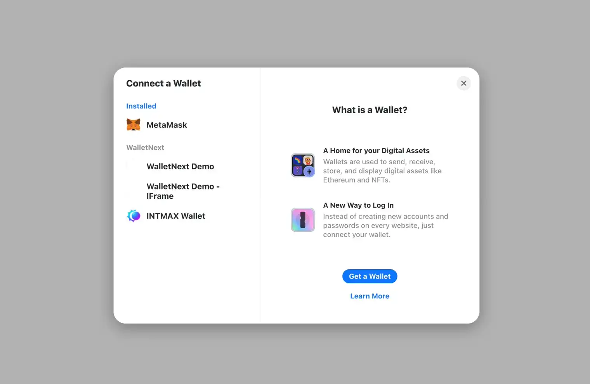

# RainbowKit SDK プラグインメソッド

### `intmaxwalletsdk(parameters: intmaxwalletsdkParameters)`

指定したパラメータで新しいウォレット接続を初期化する関数です。`parameters` オブジェクトには以下を含めることができます：

- `metadata`：dApp に関するオプションのメタデータ。
- `wallet`：ウォレットの名前、URL、アイコン URL を含むオブジェクト。
- `mode`：接続モード。`"iframe"` または `"popup"` を指定。
- `chains`：接続先のデフォルトチェーン ID。

**使用例**

```typescript
const additionalWallets = [
  intmaxwalletsdk({
    wallet: {
      url: "https://intmaxwallet-sdk-wallet.vercel.app/",
      name: "IntmaxWalletSDK Demo",
      iconUrl: "https://intmaxwallet-sdk-wallet.vercel.app/vite.svg",
    },
    metadata: {
      name: "Rainbow-Kit Demo",
      description: "Rainbow-Kit Demo",
      icons: ["https://intmaxwallet-sdk-wallet.vercel.app/vite.svg"],
    },
  }),
  intmaxwalletsdk({
    mode: "iframe",
    wallet: {
      url: "https://intmaxwallet-sdk-wallet.vercel.app/",
      name: "IntmaxWalletSDK Demo",
      iconUrl: "https://intmaxwallet-sdk-wallet.vercel.app/vite.svg",
    },
    metadata: {
      name: "Rainbow-Kit Demo",
      description: "Rainbow-Kit Demo",
      icons: ["https://intmaxwallet-sdk-wallet.vercel.app/vite.svg"],
    },
  }),
  intmaxwalletsdk({
    wallet: {
      url: "https://wallet.intmax.io",
      name: "INTMAX Wallet",
      iconUrl: "https://wallet.intmax.io/favicon.ico",
    },
    metadata: {
      name: "Rainbow-Kit Demo",
      description: "Rainbow-Kit Demo",
      icons: ["https://intmaxwallet-sdk-wallet.vercel.app/vite.svg"],
    },
  }),
];
```

**結果**



### `connectorsForWallets(wallets: Wallet[]): Connector[]`

ウォレット設定の配列を受け取り、それらのウォレットへの接続に使用できるコネクタの配列を返します。

```typescript
const connectors = connectorsForWallets([
  {
    groupName: "IntmaxWalletSDK",
    wallets: additionalWallets,
  },
]);
```

### `createConfig(config: WagmiConfig): WagmiConfig`

Wagmi SDK の設定オブジェクトを作成します。自動接続の設定、使用するコネクタ、ブロックチェーンインタラクション用のパブリッククライアントを含みます。

```typescript
const wagmiConfig = createConfig({
  autoConnect: true,
  connectors,
  publicClient,
});
```
