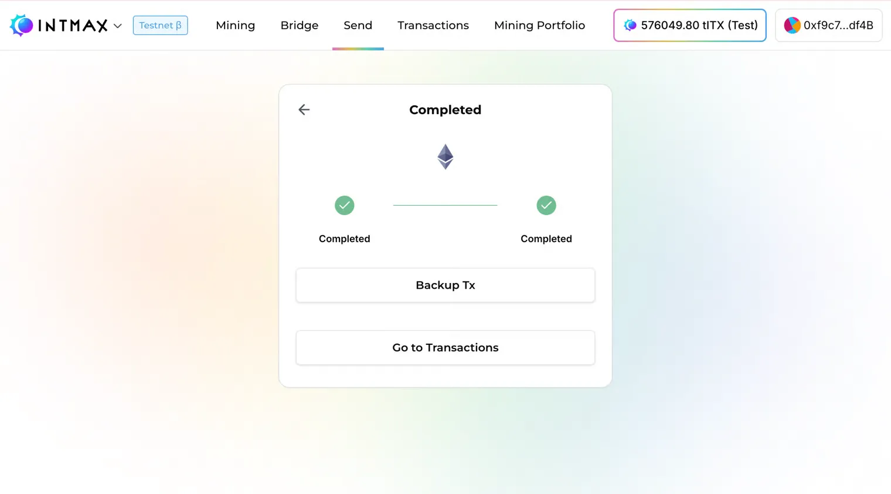
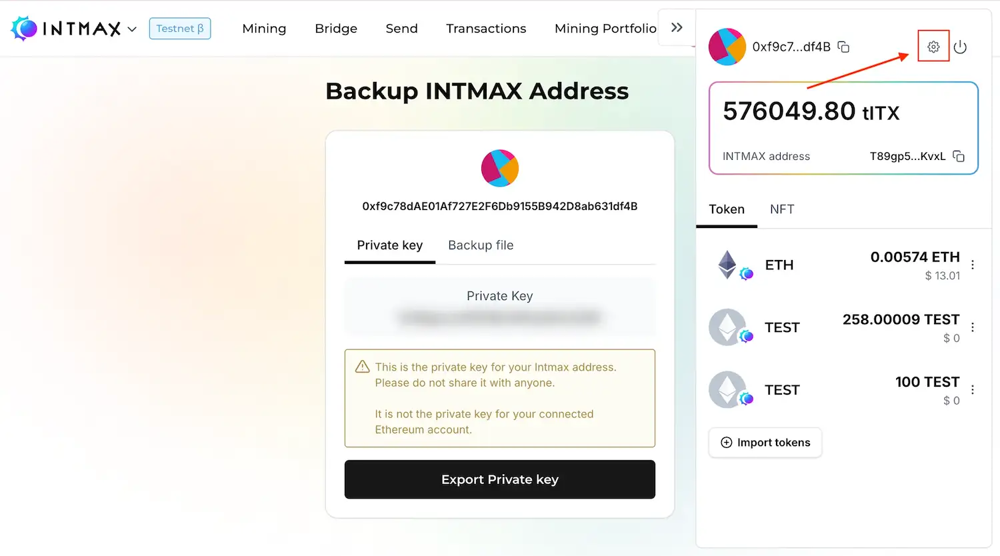
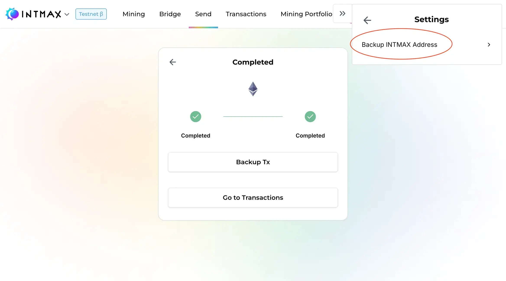
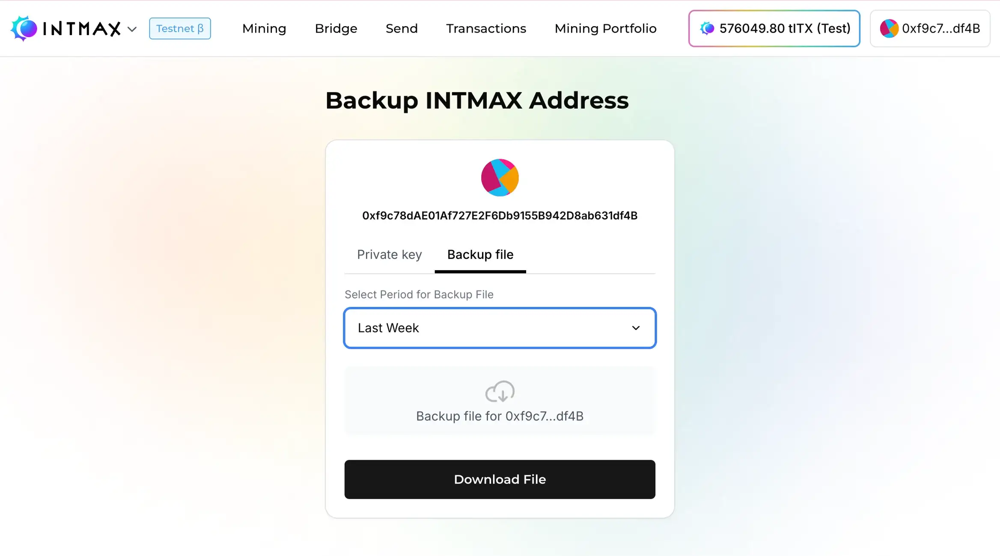
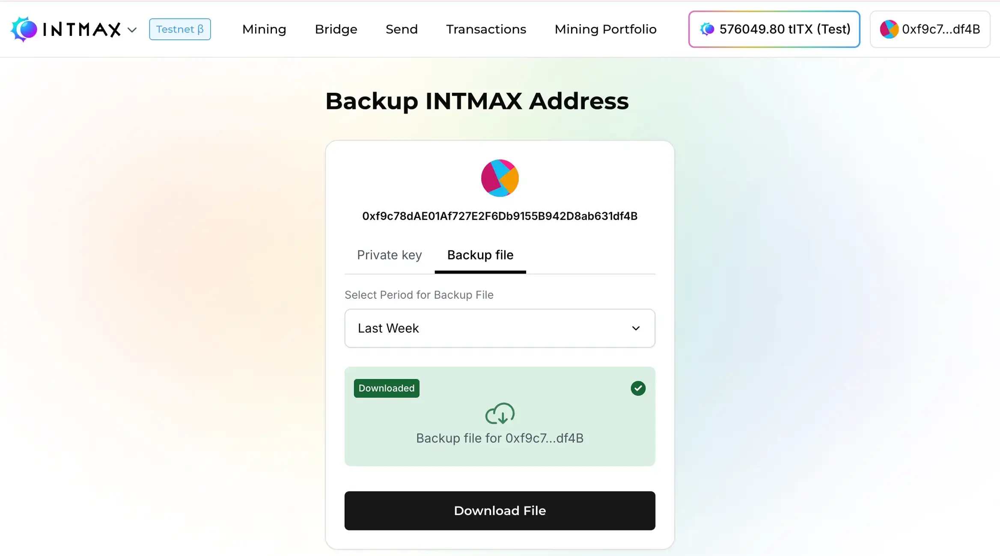
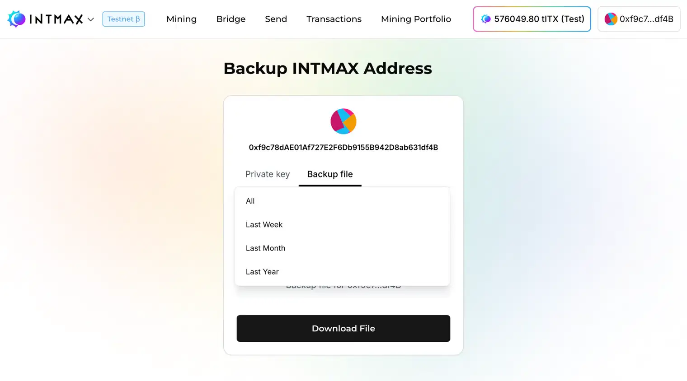

# トランザクションデータのバックアップ

## 概要

**バックアップファイル**には、ユーザーのトランザクション履歴を含む個人データが含まれます。このファイルと INTMAX の秘密鍵（Private Key）があれば、ネットワークに問題が発生した場合に INTMAX Network から Ethereum へ資産を移すことができます。

### バックアップファイルの種類

1. **トランザクション単位のバックアップ**
   - 取得方法：Deposit・Withdrawal・Transfer 実行時に表示されるバックアップボタンから
   - 内容：特定のトランザクションに関するデータ
   - 推奨度：推奨（必須ではない）

2. **包括バックアップ（設定画面）**
   - 取得方法：設定画面のバックアップ機能から
   - 内容：すべてのトランザクション履歴
   - 推奨度：強く推奨

### ファイルの詳細

- ファイル形式：CSV
- 内容：トランザクション履歴
- ファイルサイズ：トランザクションあたり約 200 KB
- 1 週間あたりの推定サイズ：約 20 MB（トランザクション頻度に依存）
- セキュリティレベル：公開しても資産への直接的なリスクなし

### バックアップのタイミング

#### 自動バックアップ通知

- Deposit・Withdrawal・Transfer の実行時にバックアップ保存ボタンが表示されます。
- トランザクション実行後のバックアップは推奨されますが、必須ではありません。

#### 包括バックアップ（設定画面）

- 設定画面から取得したバックアップファイルには、すべてのトランザクション履歴が含まれます。
- 設定画面からバックアップを保存した後は、以前ダウンロードした個別のバックアップファイルを削除できます。
- 最新の包括バックアップには、過去のすべてのデータが含まれます。

次のセクションでバックアップの手順を説明します。

### 手順

1. 歯車（⚙️）ボタンをクリック

2. 設定メニューから「Backup INTMAX Addresses」を選択

3. 「Backup file」タブに切り替え

4. ダウンロードが成功すると、以下の画面が表示されます。

#### バックアップオプション

さまざまな期間を選択できます：

- All（全履歴）
- 1 week（現在から 1 週間）
- 1 month（現在から 1 か月）
- 1 year（現在から 1 年）

#### 推奨事項

- **定期的なバックアップ：** 月に 1 回程度、設定画面からの包括バックアップを推奨します。
- **重要なトランザクション後：** トランザクション実行時に表示されるバックアップボタンを活用してください。
- **ファイル管理：** 最新の包括バックアップを保存した後は、古いファイルを削除できます。
