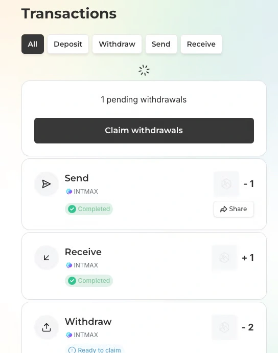

# トランザクション履歴の確認

このページでは、トランザクション履歴を確認できます。

## トランザクション履歴の概要

トランザクション一覧をカテゴリで **フィルター**して、目的の履歴を見つけやすくできます。
**履歴はプライベート**であり、他のユーザーからは閲覧できません。

**「Share」**ボタンを押すと：

- **プライベートリンク**が作成されます。
- 共有した相手だけがトランザクションの詳細を **閲覧**できます。

## トランザクションの種類

以下の 4 つのカテゴリが表示されます：

- **Deposit** — Ethereum メインネットから INTMAX Network へトークンを移動
- **Withdraw** — INTMAX Network から Ethereum メインネットへトークンを移動
- **Send** — 他の INTMAX アドレスへトークンを送信
- **Receive** — 他の INTMAX アドレスからトークンを受信


**マイニングのトランザクション一覧** はここには表示されません。
[Mining Portfolio](https://app.intmax.io/mining-portfolio) を参照ください。


