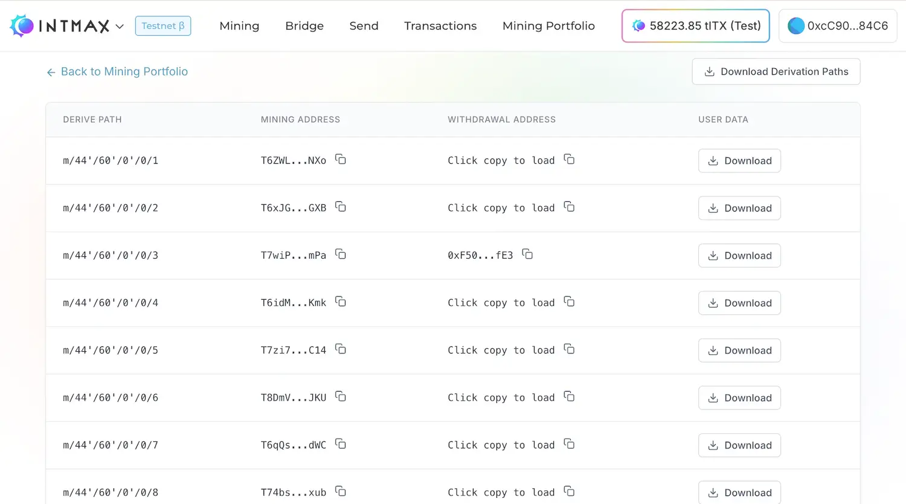
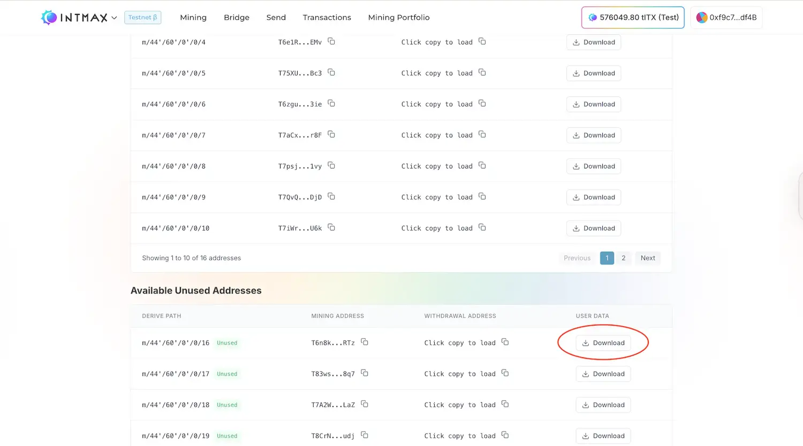

# FAQ と トラブルシューティング

### Q: マイニングのルールの詳細や、ITX の獲得方法を知りたいです。

A: INTMAX Testnet で Claim できるトークンはテストネット専用であり、Mainnet の ITX トークンとは異なります。

現在、Ethereum Mainnet でマイニングが稼働しています。https://intmax.io からお試しください。マイニングで獲得した ITX は現時点では Transfer できませんが、将来的には INTMAX エコシステム内で利用可能な Transfer 可能なトークンになる予定です。

### Q: 0.1 ETH や 1 ETH を Deposit すると ITX がもらえるのはなぜですか？

A: Privacy Mining では、0.1 ETH、1 ETH、10 ETH、または 100 ETH を Deposit することでプライバシー創出に貢献し、そのリワードとして ITX を受け取ります。同じ金額を Deposit することはマイニングで行う作業と本質的に同じであるため、リワードの受取対象になります。

### Q: Privacy Mining は現在 CLI で行われていると思いますが、この Testnet マイニングとの違いは何ですか？

A: 現在は、テストネットトークンではなく、将来実際に市場で流通する ITX を獲得できます。
マイニングは CLI だけでなく、https://app.intmax.io のユーザーフレンドリーな UI/UX からも可能です。

### Q: INT や INTMX というトークンがありますが、これらは INTMAX と関係がありますか？

A: いいえ、それらは INTMAX を装った詐欺です。
関わらないようご注意ください。
INTMAX のトークンは ITX であり、現時点では Transfer 機能はありません。
したがって、売買できるという主張はすべて虚偽です。

### Q: ウォレットは接続されているはずなのに、残高などが表示されません。

A: 以下の手順をお試しください：
Web サイトをリロードしてください。
ブラウザで開いているすべてのタブを閉じてから、ブラウザ自体を閉じてください。その後ブラウザを再度開いてください。
使用しているウォレット以外の拡張機能が、クリックしない限りサイトデータの読み取りや変更を行わない設定になっていることを確認してください。
https://support.google.com/chrome_webstore/answer/2664769

### Q: モバイルデバイスでウォレットアプリを使用する際の推奨方法は？

A: モバイルデバイスでモバイルウォレットを使用する場合は、各ウォレットアプリ内のアプリ内ブラウザ（In-App Browser）から dApp にアクセスすることを強く推奨します。Chrome や Brave などの外部モバイルブラウザ経由で dApp に接続すると、一部のウォレットが不安定になる場合があります。dApp との通信やトランザクションの署名に問題が生じることがあります。アプリ内ブラウザを使用することで、ウォレットと dApp が同じセキュアな環境内で動作し、接続の問題が大幅に軽減されます。

### Q: アプリ内ブラウザに対応しているモバイルウォレットは？

A: アプリ内ブラウザに対応している主なモバイルウォレットは以下の通りです：

- MetaMask
- Trust Wallet
- Coinbase Wallet
- OKX Wallet

### Q: マイニング用に Deposit した資産が消えたように見えます。確認方法を教えてください。

A: 通常の Deposit とマイニング用の Deposit では異なるアドレスが使用されることにご注意ください。通常の Deposit は Transactions ページに、マイニング用の Deposit は Mining Portfolio ページに表示されます。
問題が解決しない場合は、以下の手順で確認してください。

以下の手順で Deposit 先アドレスを確認してください。

1. [マイニングアドレス一覧ページ](https://app.intmax.io/mining-address-list)を開きます。
2. 接続中のウォレットで 2 回署名すると、関連するアドレスの一覧が表示されます。
3. この一覧のスクリーンショットを撮り、サポートに共有してください。
4. この画面では 2 つのことができます：
   a. **ユーザーデータファイルのダウンロード：** このファイルを確認することで残高を確認できます。
   b. **Withdrawal アドレスの確認：** Redeposit 時に使用される Ethereum（Sepolia）アドレスが表示されます。Redeposit を行った場合、Etherscan でこのアドレスに ETH が Deposit されたことを確認できます。

5. 「Available Unused Addresses」セクションの直下にあるアドレスの USER DATA をダウンロードし、サポートに共有してください。

### Q: マイニングページから Deposit しましたが、マイニングポートフォリオに表示されません。確認方法を教えてください。

A: 以下のページを参照してください：

[解決済みの問題：マイニングポートフォリオに ETH の Deposit が表示されない](resolved-issue.md#eth-deposits-not-displaying-in-mining-portfolio)
