# その他の機能

## 残額の Withdrawal

マイニング完了時に、アドレスに少額の ETH（ガス代相当額程度）が残る場合があります。
これは特に、Ethereum のガス代が高い時に Withdrawal を実行した場合に発生します。
以下では、この残りの ETH を Withdrawal する手順を説明します。

1. マイニングに使用したアドレスにガス代を上回る ETH が残っている場合、「Withdraw Rest Amount」ボタンが表示されます。
   この金額を Withdrawal したい場合は、「Withdraw Rest Amount」ボタンをクリックしてください。

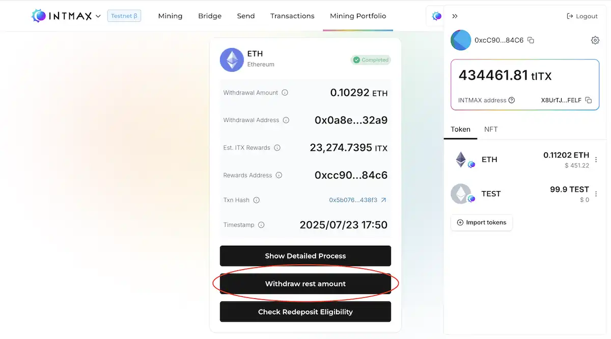

2. Withdrawal 先アドレスは、以前使用したアドレスと同じものしか指定できません。
   別のアドレスを自由に選択することはできません。

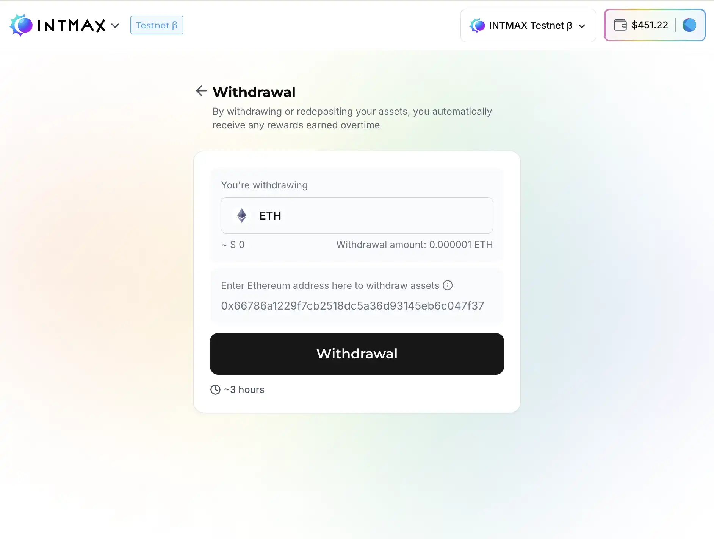

3. トランザクションの詳細を確認し、「Confirm」ボタンをクリックします。

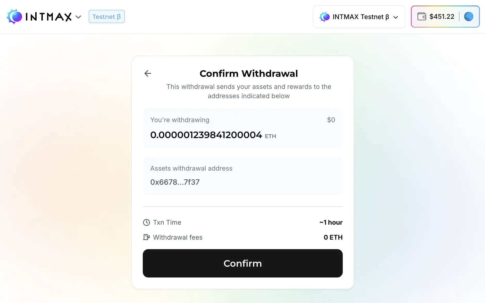

4. ステータスが「Sync Withdrawals」に変わるまでお待ちください。

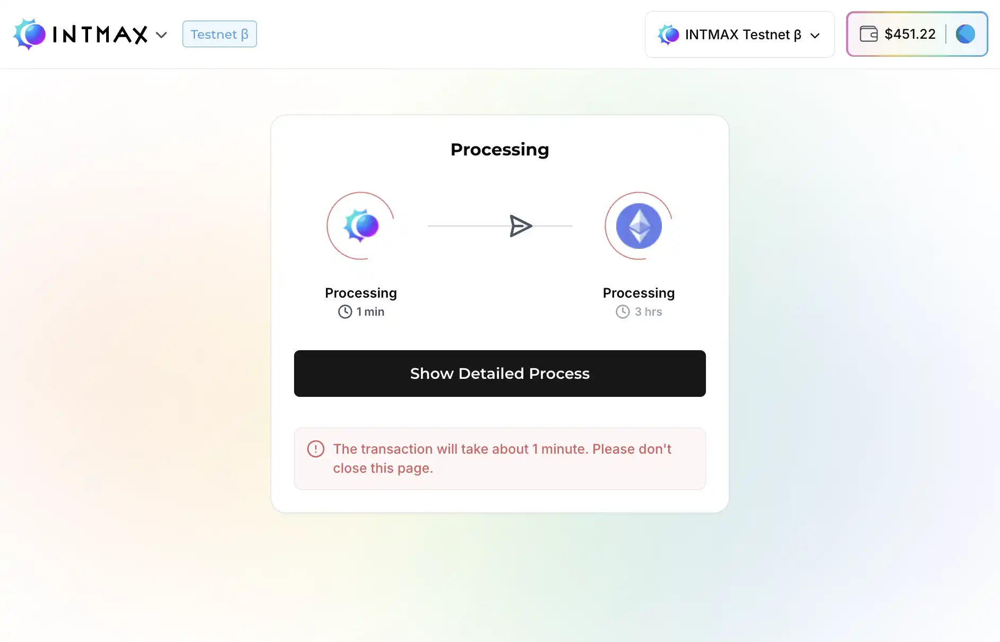

5. ステータスが「Completed」になったら、画面を離れても問題ありません。

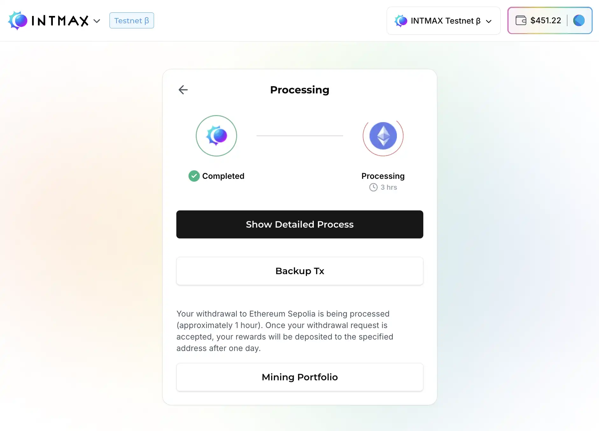

**注意**：処理中に画面を閉じた場合は、手順の最初からやり直してください。

## マイニングのキャンセル

ロック期間が満了する前でもマイニングセッションをキャンセルできます。ただし、キャンセルした場合は**リワードは付与されず**、Deposit した ETH のみが返還されます。

1. まず、**「Cancel Mining Session」**ボタンをクリックします。

2. 確認ダイアログが表示され、ロック期間がまだ終了していない場合はリワードを受け取る機会を失う可能性があることが警告されます。
   **「Yes, Proceed」**を選択するとキャンセル処理が続行され、Withdrawal 画面にリダイレクトされます。

  
  

3. ここで、送信先の Ethereum アドレスを入力し、**「Cancel + Withdrawal」**ボタンをクリックして Deposit した ETH を Withdrawal します。

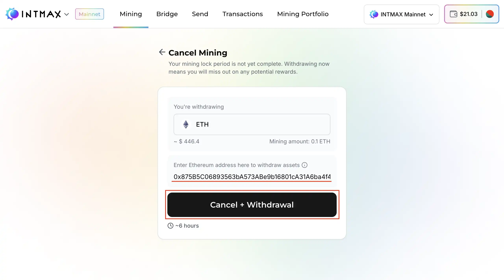

## 中断された Claim の再開

通常、Claim 可能なマイニングセッションでは、「Withdraw」または「Redeposit」ボタンをクリックし、画面の指示に従うことでリワードを Claim できます。
ただし、処理完了前にブラウザを閉じた場合など、このプロセスが中断されることがあります。

そのようなマイニングセッションの詳細ページを開くと、「Claim Rewards」ボタンと警告メッセージが表示されます。
「Claim Rewards」ボタンをクリックすると、中断されたプロセスを再開できます。

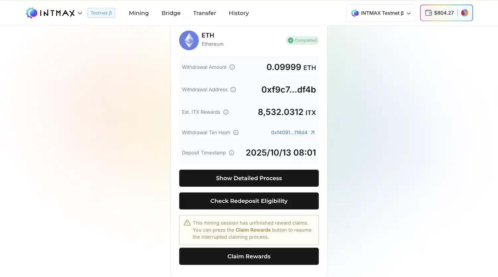

ボタンの表示が変わり、Claim プロセスの実行が試みられます。

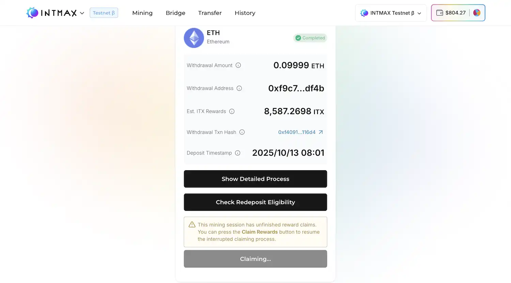

Claim 手数料の支払いがまだの場合、「Top Up for Claim Fee」ボタンが表示されます。ボタンをクリックしてください。

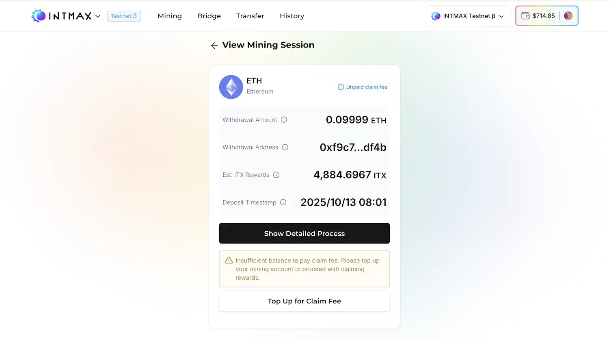

以下のようなモーダルが表示される場合がありますが、「Next」ボタンをクリックしてください。

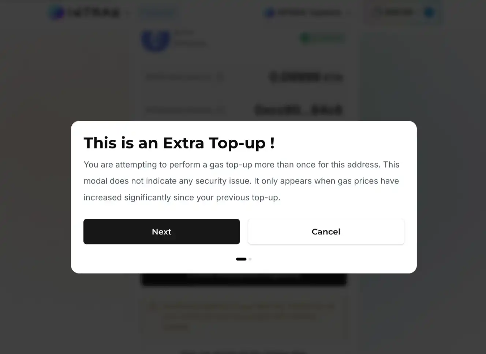

「Yes, Proceed」ボタンをクリックします。

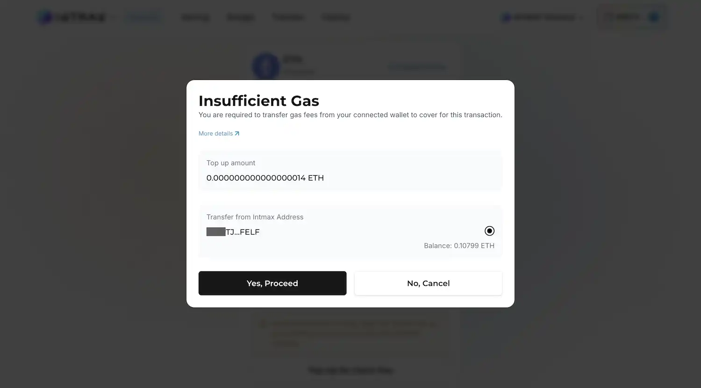

Transfer の詳細を確認し、「Send」ボタンをクリックします。

接続中のウォレットが署名を求めます。

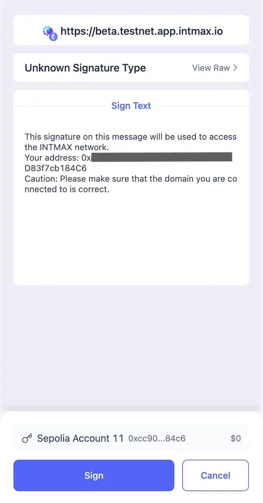

署名が完了すると、Transfer の待機画面が表示されます。

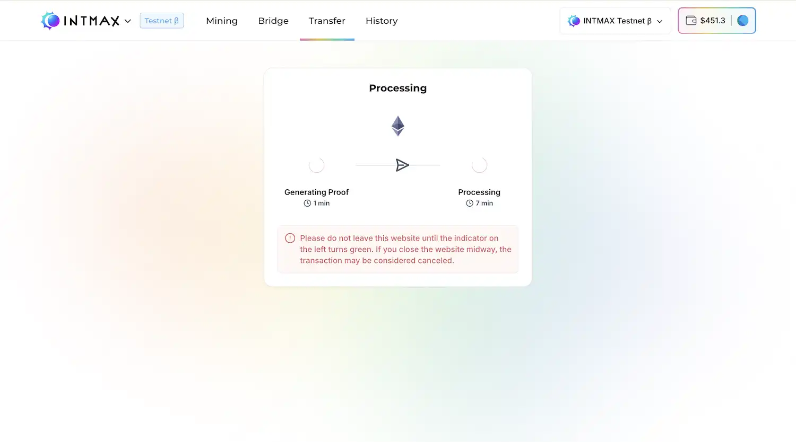

Transfer リクエストが完了すると、ステータスが変わります。「Go to Active Mining」ボタンをクリックすると、マイニングセッションの詳細画面に戻ります。

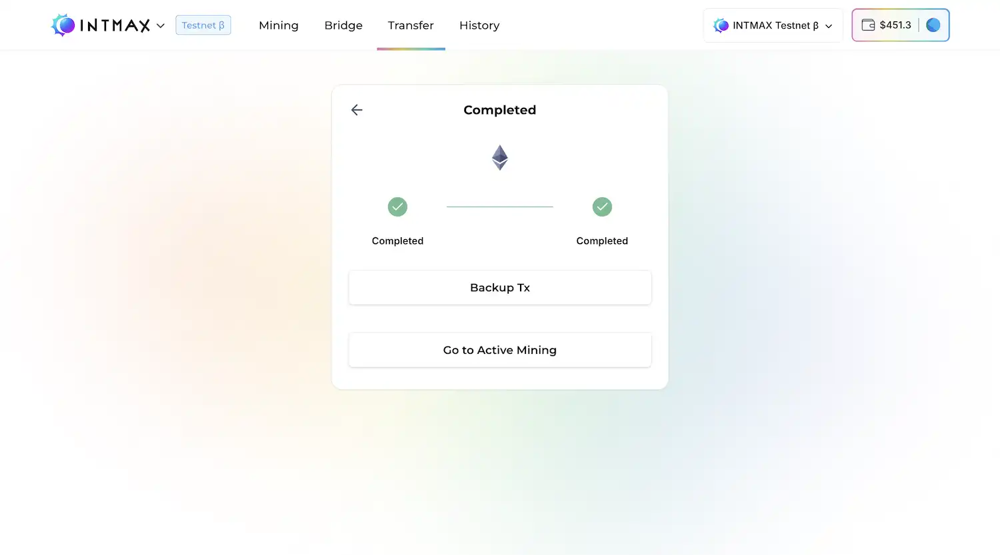

「Claim Rewards」ボタンは約 5 分間クリックできなくなります。

ガス代の補充が完了すると、「Claim Rewards」ボタンが再びクリック可能になります。ボタンをクリックしてください。

「Claim Rewards」ボタンが表示されなくなったら、ITX トークンのリワード Claim は完了です。

この時点で「Top Up for Claim Fee」ボタンが再度表示された場合は、約 10 分待ってからマイニングセッションを再確認してください。

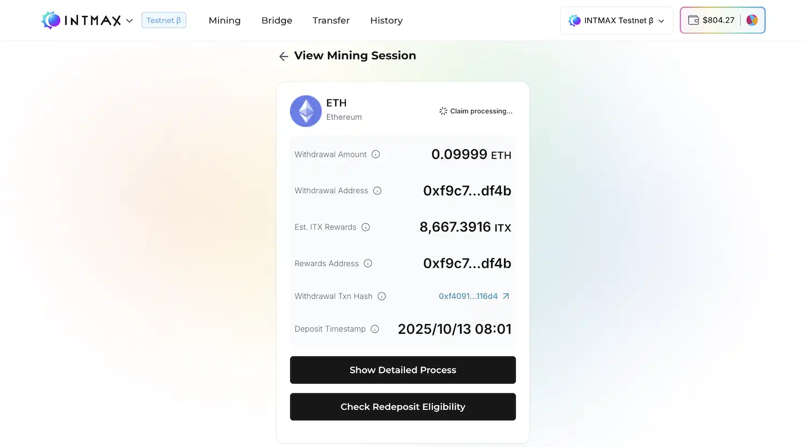

## コントラクトアドレスへの ETH Withdrawal

マイニングでコントラクトアドレスへ ETH を Withdrawal する手順を説明します。

### :warning: **重要なお知らせ**

Withdrawal 先アドレスを指定する際は、**ご自身のアドレス**であることを必ず確認してください。
特に、**コントラクトアドレス**や**取引所アドレス**を Withdrawal 先に指定することは**サポート対象外**であり、そのような場合の責任は負いかねます。
コントラクトアドレスへ ETH を送信する場合は、そのコントラクトが **ETH の Deposit を受け取れる**ことを慎重に確認してください。

### 1. 目的

この機能は、コントラクトアドレスへの Withdrawal を試みた際などに「Withdrawal 可能」状態になった ETH を、指定アドレスへ実際に送信するためのものです。

**注意**：通常のアドレス（EOA）への送信では、ETH はアドレスに直接届きます。

### 2. ボタンの表示条件

- 送信先アカウントに Withdrawal 可能な ETH 残高がある場合にボタンが表示されます。
- 保留中の Withdrawal がある場合、ボタンは Claim プロセスを開始します。

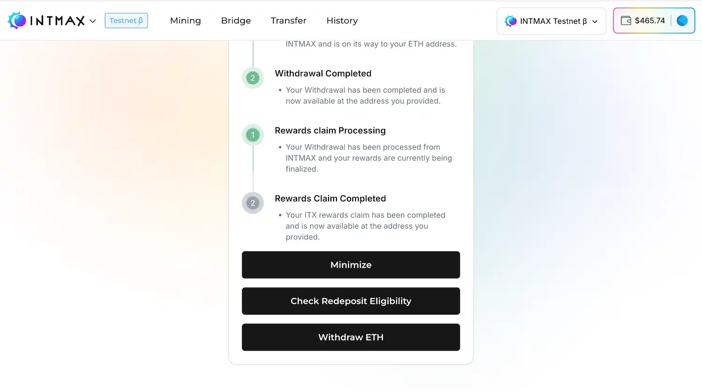

### 3. Withdrawal の仕組み

- ボタンをクリックすると、**接続中のウォレットでトランザクションに署名する**よう求められます。
- この操作により、Ethereum 上で資金が利用可能になります。

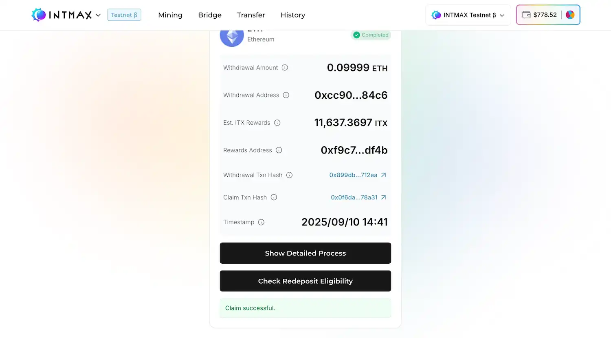
