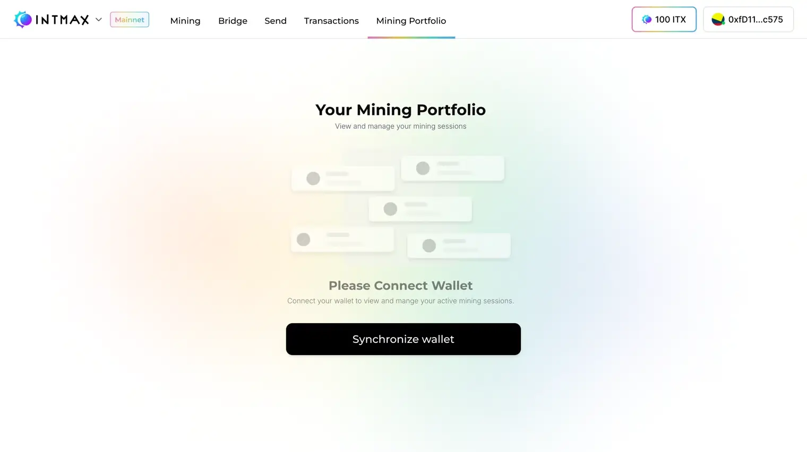
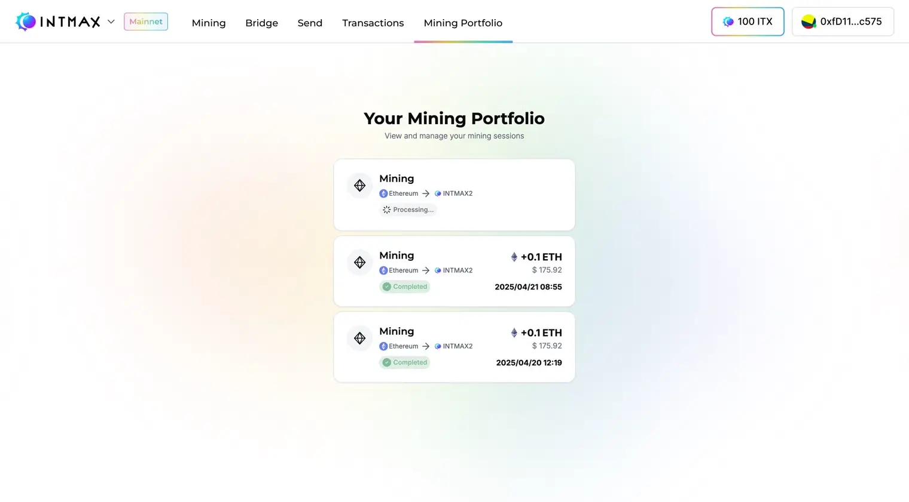

# ポートフォリオ

マイニングポートフォリオでは、アカウントに紐づくすべてのアクティブなマイニングアクティビティと過去のマイニングセッションを一覧で確認できます。Deposit、リワード、マイニング全体のパフォーマンスを一か所で追跡できます。

アカウントでマイニングアクティビティが行われていない場合、ポートフォリオは空で表示されます。マイニングが開始されると、アクティブなセッションと進行中のアクティビティが表示されます。

## マイニングステータス

マイニングステータスは、マイニングセッションの現在の状態を示します：

- **Deposit Processing** — Deposit 直後の状態。この時点ではロック期間はまだ開始されていません。
- **Mining in Progress** — マイニング期間中に資金がロックされている状態
- **Canceled** — マイニングが途中でキャンセルされたか、マイニングルールに違反した状態。この Web サイトに従ってマイニングしている場合、ルール違反にはなりません。
- **Ready to Claim** — マイニングリワードの Claim が可能な状態
- **Completed** — マイニングリワードの Claim が正常に完了した状態（ただし、Redeposit はまだ完了していない場合があります）

  
  

## 補足事項

マイニングアクティビティはトランザクションページには反映されません。つまり、マイニングに関連する Deposit と Withdrawal は通常のトランザクション一覧には表示されません。ただし、ガス代補充のために行った Deposit はトランザクションページに表示されます。
