# Redeposit

Redeposit 機能について、以下の点に留意してください：

- 最初のマイニングラウンドが完了した後、自動的に次のラウンドに資金を Deposit できる機能です。
- Withdrawal のために新しいウォレットを繰り返し作成する手間を省くために用意されています。
- 資産の Withdrawal（システムが生成するアドレスへの送金）、ITX の Claim、そして Redeposit の 3 つのプロセスを一括で行います。
- システムが生成したアドレスにガス代を補充する必要があります。これにより、Redeposit のタイミングが来た際にシステムが資金を送出できます。
- ガス代の急激な変動により、2 回以上のガス補充が必要になる場合があります。
- Redeposit は最初の 2 つのプロセス（Withdrawal と Claim）が正常に完了した後に開始されます。その後、システムが生成したアドレスに送られた資金を Deposit し、次のマイニングラウンドに使用します。

## ステップバイステップガイド

### マイニングセッションの選択

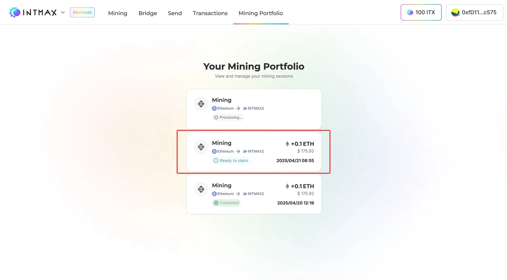

上の画像のマイニングポートフォリオから、「Ready to Claim」ステータスのマイニングセッションをクリックします。このステータスは、マイニング期間が経過し、資産の Withdrawal や Redeposit、およびリワードの Claim が同時に行えることを意味します。

### リワード Claim の開始

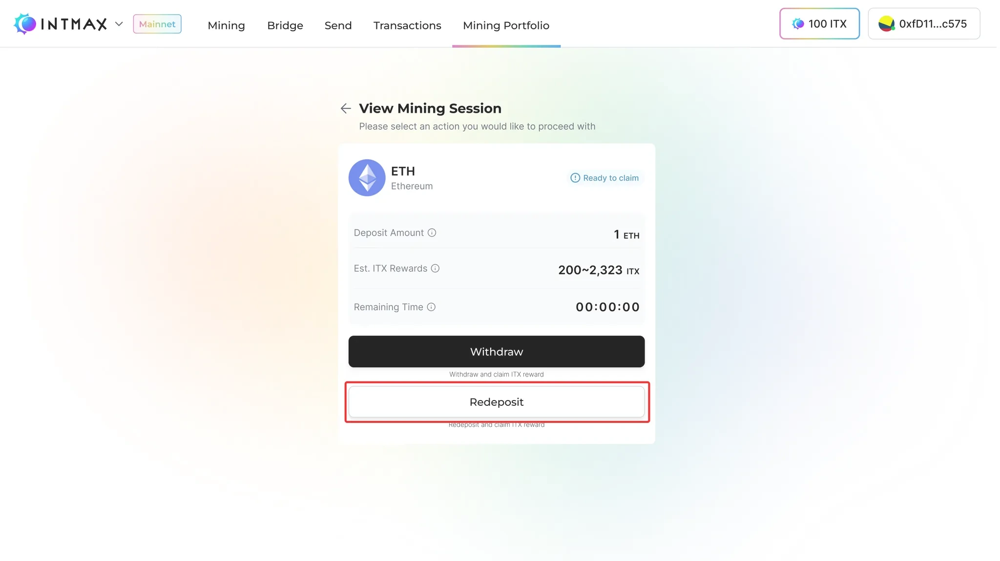

上のページには Withdraw と Redeposit のオプションがあります。Redeposit をクリックして Redeposit 機能を実行します。

Redeposit を進めるには、まず蓄積されたリワードを Claim する必要があります。「Proceed」をクリックして続行します。

メッセージに署名します：

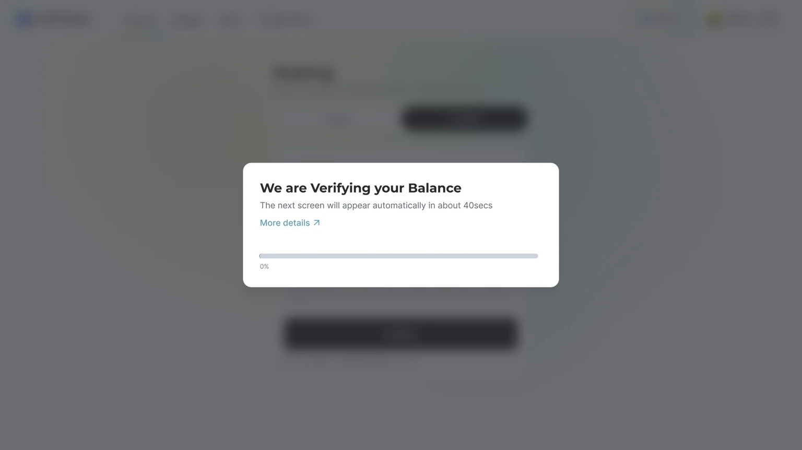

この段階では、システムが残高を確認し、資金が利用可能かどうかを検証しています。約 40 秒お待ちください。画面は自動的に遷移します。

**注意**：INTMAX はステートレスであるため、データはクライアント側に保存されており、システムはユーザーのアカウント状態を把握していません。そのため、この検証プロセスが必要です。

### ガス代の補充

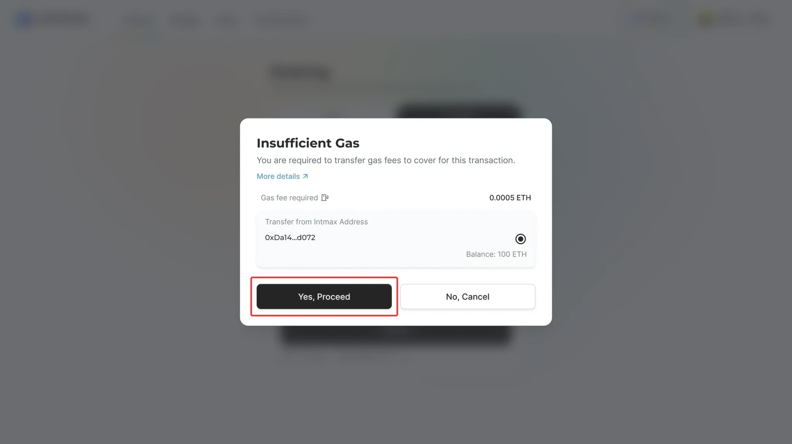

資金が利用可能であることが確認されました。Redeposit トランザクションに必要なガス代を補充します。

**注意**：ガス代の急激な変動により、2 回以上のガス補充が必要になる場合があります。

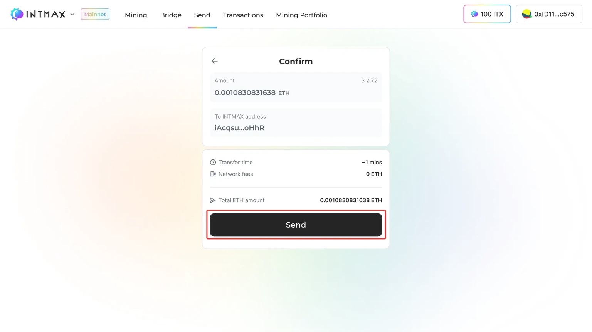

ガス補充のトランザクションを確認します：

トランザクションに署名します：

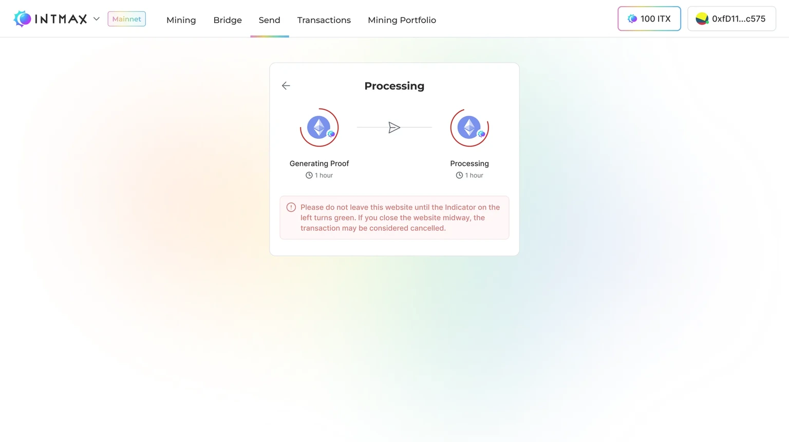

左側のインジケーターが緑色に変わるまで、このページでお待ちください。緑色に変わるまでは、ページを閉じたり離れたりしないでください。

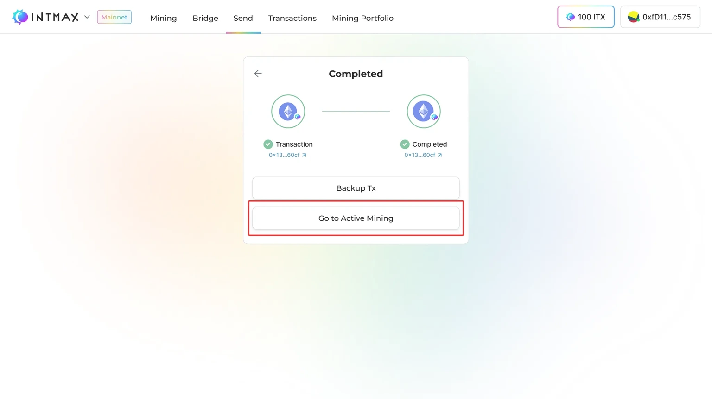

両方のインジケーターが緑色になったら、ページを離れるか、上のボタンをクリックしてアクティブなマイニングセッションに移動できます。

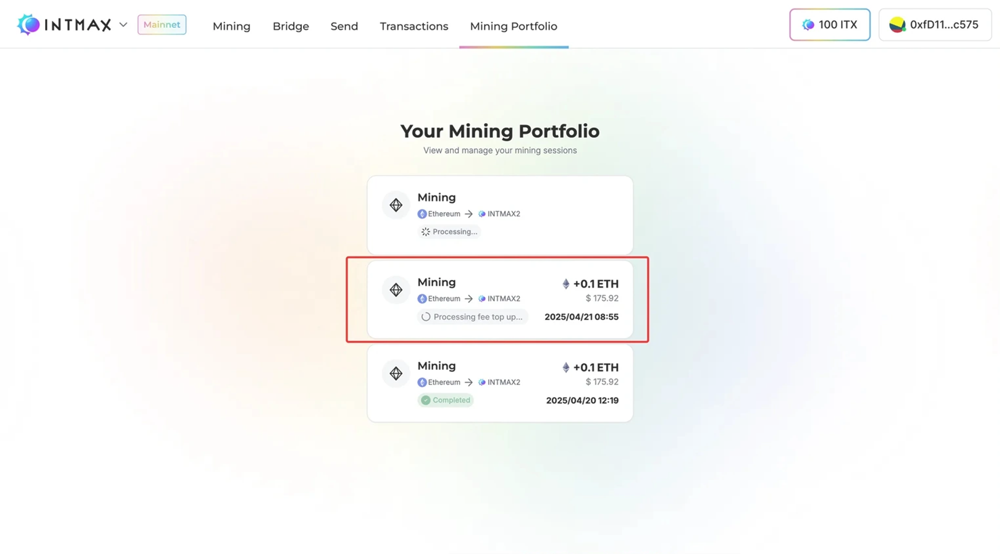

マイニングページに戻ると、トランザクションのステータスが「Processing fee top up」に更新されています。クリックすると詳細を確認できます。

5 分以上待ってもステータスが更新されない場合は、ページを再読み込みするか、ウォレットの再接続を試してください。

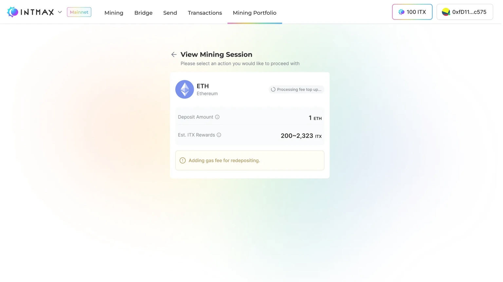

**注意**：この時点では、リワードの Claim と ETH の Withdrawal はまだ実行されていません。

### マイニングステータスの確認

ガス代の処理が完了すると、ステータスが「Ready to Claim」に戻ります。「Ready to Claim」ステータスのマイニングセッションをクリックします。

再度 Redeposit をクリックして、Redeposit アクションを実行します。

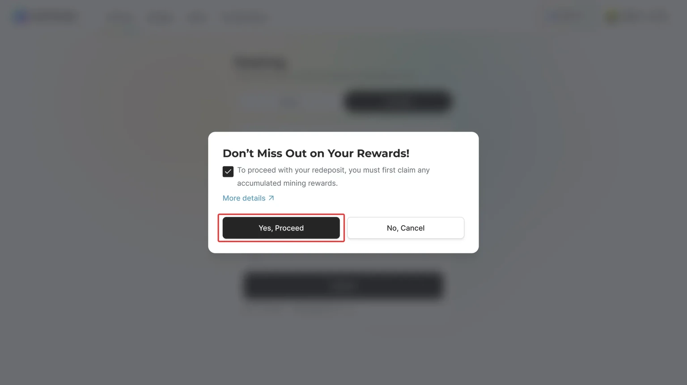

Redeposit を進めるには、まず蓄積されたリワードを Claim する必要があります。「Proceed」をクリックして続行します。

メッセージに署名します：

この段階で、システムは再び残高を確認し、資金がまだ利用可能かどうかを検証します。約 40 秒お待ちください。画面は自動的に遷移します。

**注意**：INTMAX はステートレスであるため、データはクライアント側に保存されており、システムはユーザーのアカウント状態を把握していません。そのため、この検証プロセスが必要です。

### ETH の Withdrawal と ITX の Claim

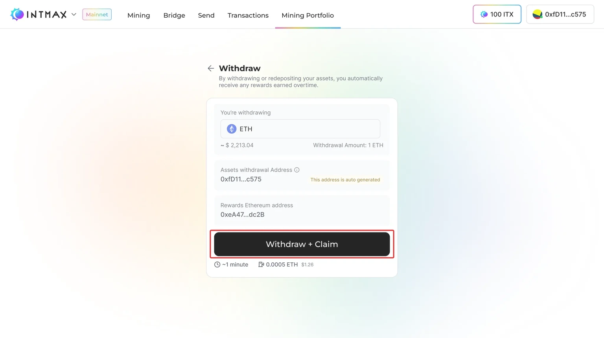

このフォームでは、Withdrawal 先アドレスにシステムが自動生成したアドレスがあらかじめ入力されています。リワードの受取先として、接続中のウォレットアドレスが自動的に入力されています。別のアドレスを使用したい場合は、手動で変更してください。

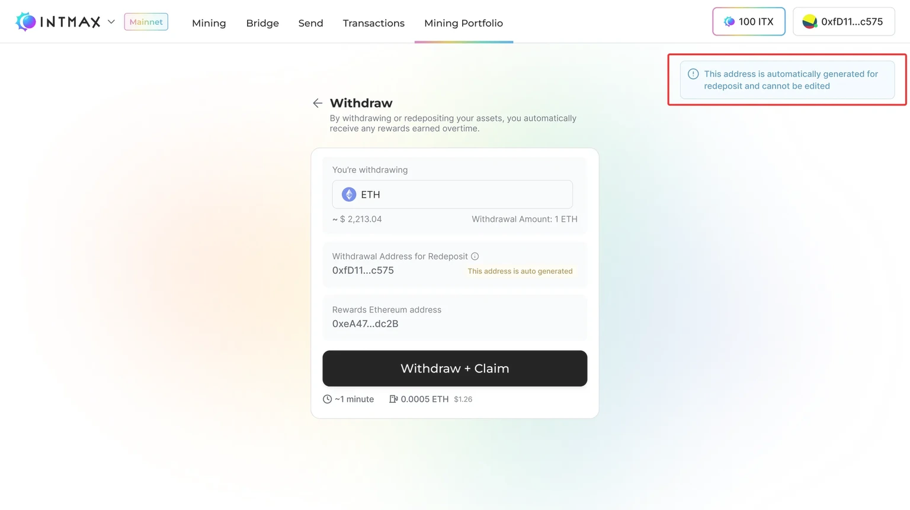

Redeposit 用の Withdrawal アドレスは、システムが Redeposit のために自動生成するため、編集できません。

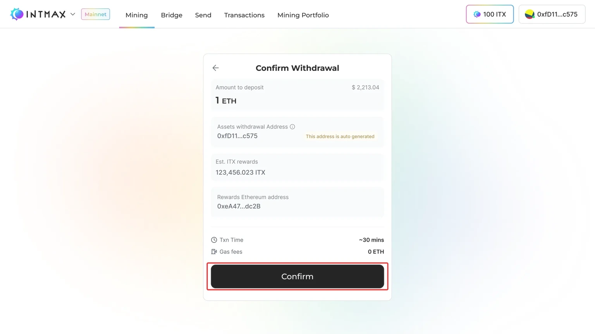

Withdrawal の詳細を再確認し、内容が正しいことを確認します。

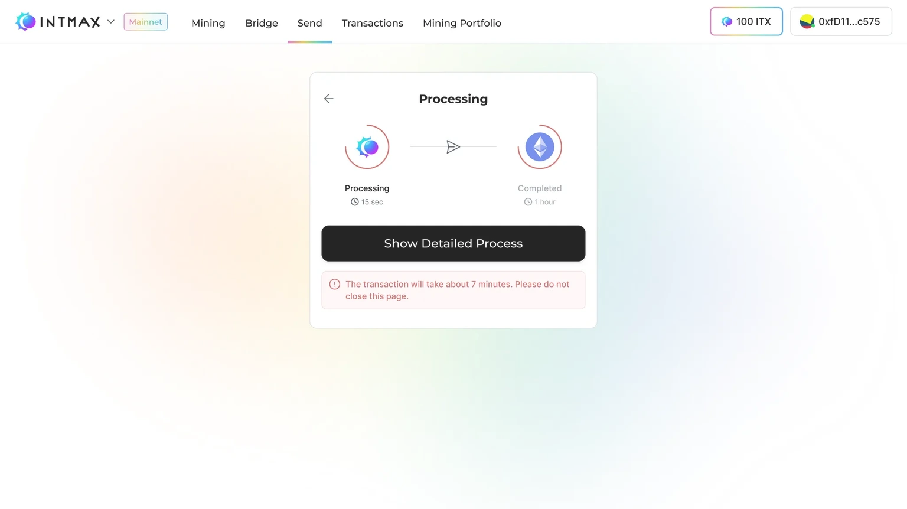

この画面で数分間お待ちください。

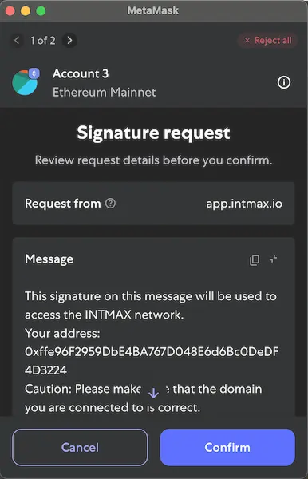

トランザクションに署名します：

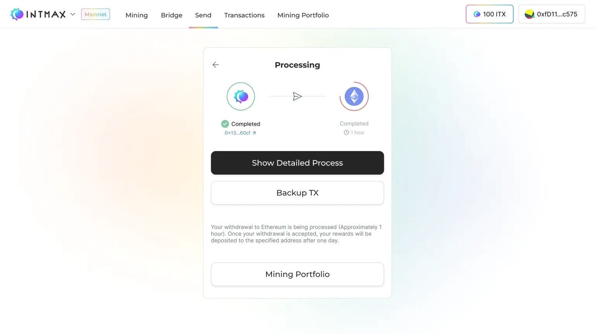

左側のインジケーターが緑色に変わると、Withdrawal が正常に開始されたことを意味します。ページを安全に閉じることができます。「Show detailed process」をクリックすると、プロセスのステップごとの内訳とステータスを確認できます。

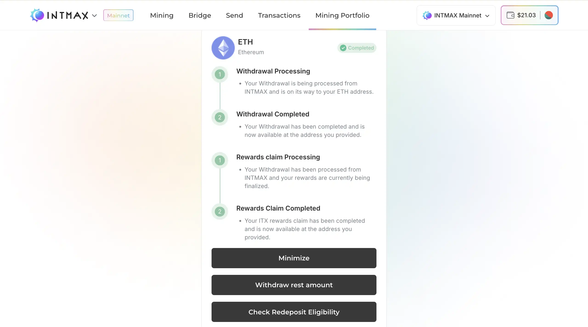

トランザクションの完了を待つ間、このページを閉じても問題ありません。

### 重要な注意事項

- トランザクション処理中は、約 2 分間 INTMAX の Web サイトを閉じたりページから離れたりしないでください。途中で Web ページを閉じると、トランザクションがキャンセルされ、Withdrawal プロセスを最初からやり直す必要があります。
- 画面左側に表示されるトランザクションインジケーターが緑色に変わると、Withdrawal が正常に開始されたことを意味します。インジケーターが緑色になって初めて、トランザクションに影響なく Web ページを閉じることができます。
- 資産の到着時間は資産の種類によって異なります。Withdrawal した ETH は通常、最大 11 時間以内に届きます。ITX トークンは、Withdrawal リクエストが正常に処理された翌日の UTC 00:00 に届く予定です。

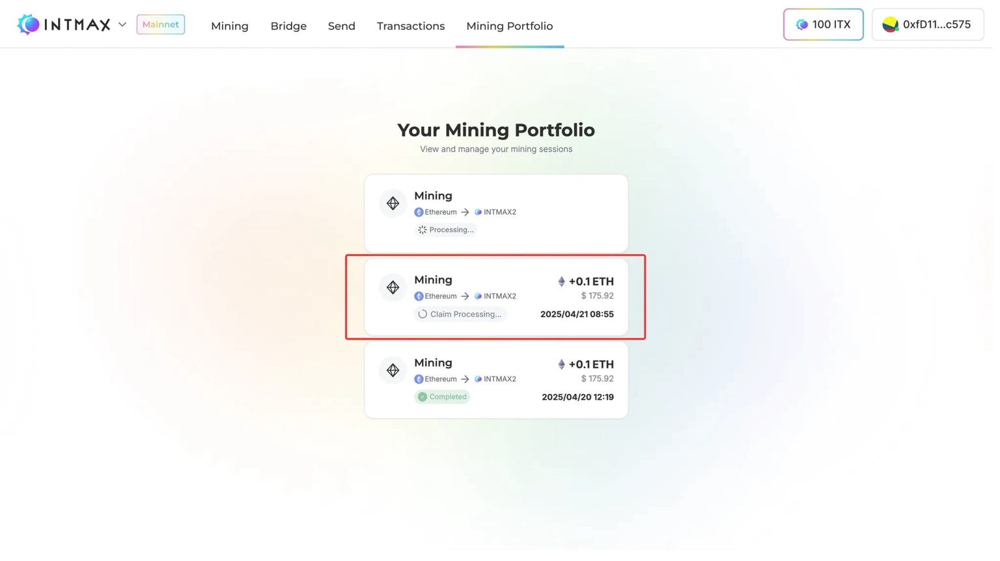

Withdrawal と Claim が開始されると、マイニングセッションのステータスが「Claim Processing」に更新されます。リワード（ITX トークン）は、Withdrawal リクエストが正常に処理された翌日の UTC 00:00 に届く予定です。

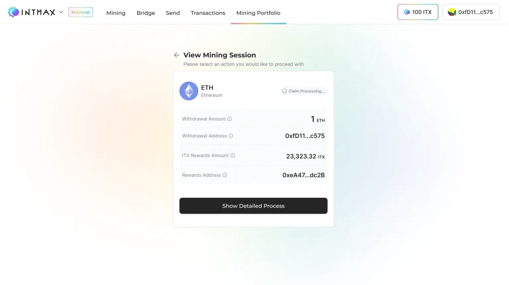

### 再度 Deposit する

「Completed」と表示されたら、該当するマイニングセッションをクリックして、Redeposit の適格条件を満たしているか確認します。

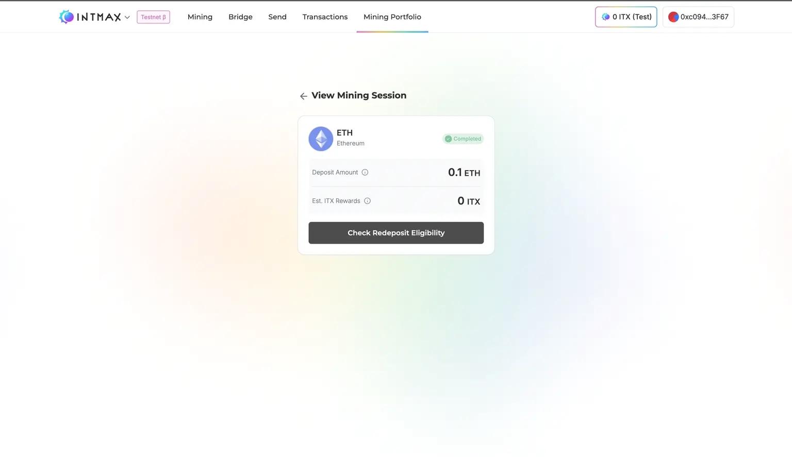

適格性が確認できたら、「Proceed Redeposit」ボタンをクリックして進みます。

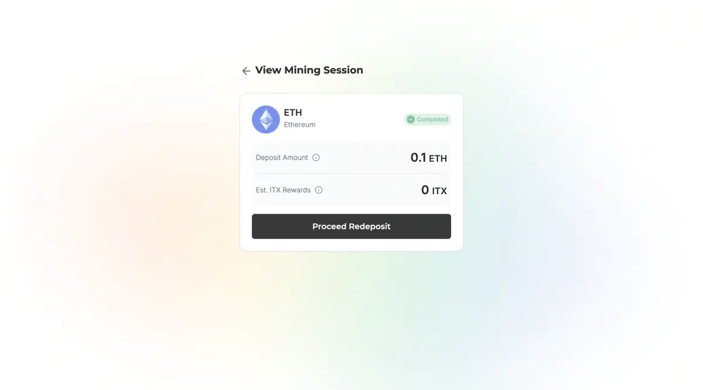

「Redeposit」ボタンをクリックしてアクションを確定し、トランザクションの処理を待ちます。

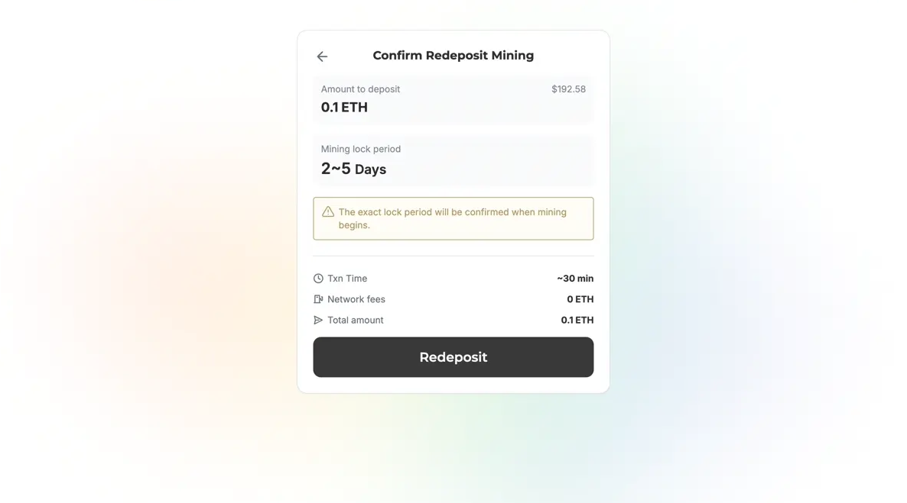

「Completed」と表示されたら、該当するマイニングセッションをクリックして Redeposit の適格条件を満たしているか確認します。適格性が確認できたら、「Proceed Redeposit」ボタンをクリックして進みます。

最後に「Redeposit」ボタンをもう一度クリックしてアクションを確定します。トランザクションが完全に処理されるまでお待ちください。

以上の手順に従うことで、リワードの Redeposit が正常に完了し、INTMAX Network でのマイニングを最適化できます。
