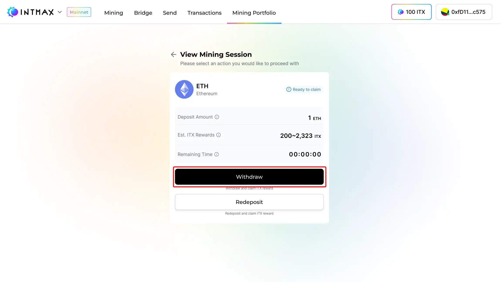
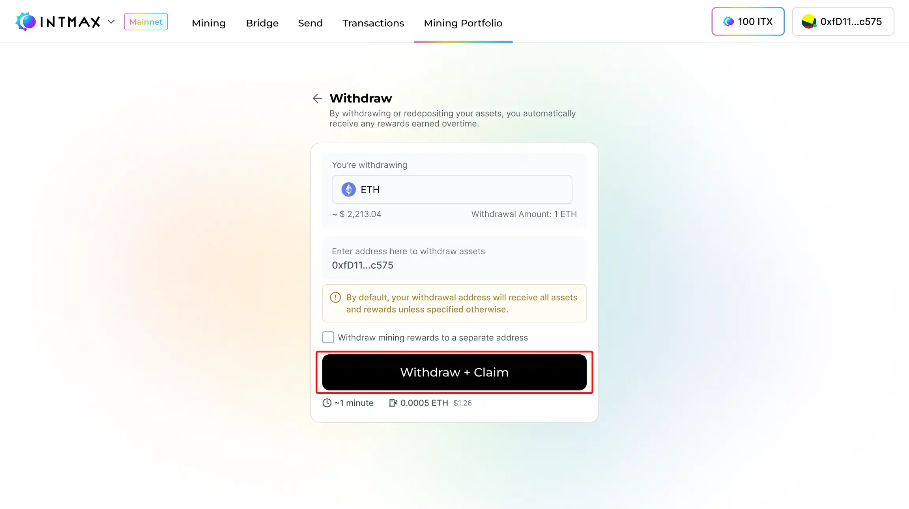
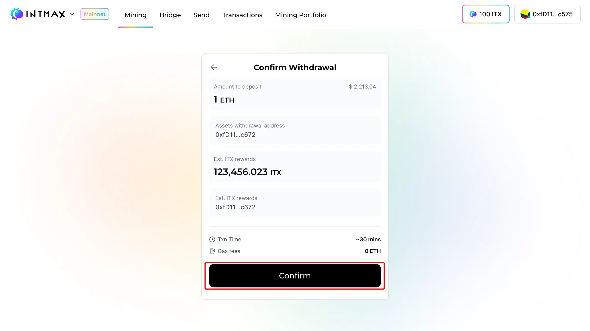

# Withdraw

Deposit した資産とリワードを INTMAX から Withdrawal するには、まずダッシュボードからアクセスできる**マイニングポートフォリオ**ページに移動します。このページで、資産を Withdrawal したいマイニングセッションを確認・選択します。セッションのステータスが**「Ready to Claim」**に更新されていることを確認してください。このステータスが表示されるまで Withdrawal は開始できません。

ステータスを確認したら、選択したマイニングセッションの**「Withdraw」**ボタンをクリックします。リワードの Withdrawal 先アドレス（Withdrawal した資産とリワードの送付先）の入力を求められます。セキュリティ強化と潜在的な問題回避のため、この Withdrawal 先アドレスはマイニングアカウントに接続されているアドレスとは異なるものを使用してください。

Deposit した資産とリワードを Withdrawal するためのアドレスを入力します。このアドレスがマイニングアカウントに接続されているアドレスと異なることを確認してください。特に指定がない限り、すべての資産とリワードはこのアドレスに送付されます。

Withdrawal 先アドレスを入力したら、確認ページに進みます。ここで、Withdrawal 先アドレス、資産金額、リワード合計など、表示されたすべての Withdrawal 詳細を慎重に確認してください。エラーや遅延を防ぐため、正確性を確認します。すべての内容に問題がなければ、再度「Withdraw」ボタンをクリックして Withdrawal トランザクションを確定・開始します。

確認ページで詳細を確認し、問題がなければ**「Confirm」**ボタンをクリックして Withdrawal プロセスを完了します。

トランザクション処理中は、約 2 分間 INTMAX の Web サイトを閉じたりページから離れたりしないでください。途中で Web ページを閉じると、トランザクションがキャンセルされ、Withdrawal プロセスを最初からやり直す必要があります。

画面左側に表示されるトランザクションインジケーターが緑色に変わると、Withdrawal が正常に開始されたことを意味します。インジケーターが緑色になって初めて、トランザクションに影響なく Web ページを閉じることができます。

資産の到着時間は資産の種類によって異なります。Withdrawal した ETH は通常、最大 7 時間以内に届きます。ITX トークンは、Withdrawal リクエストが正常に処理された翌日の UTC 00:00 に届く予定です。
