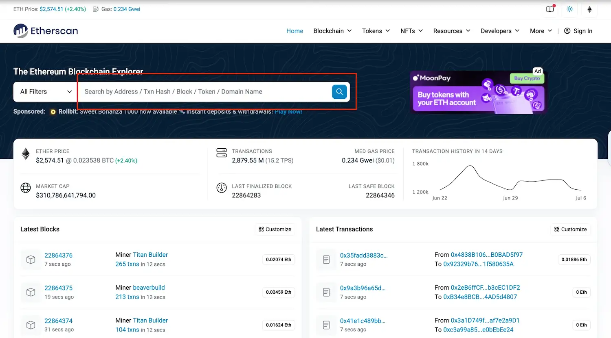
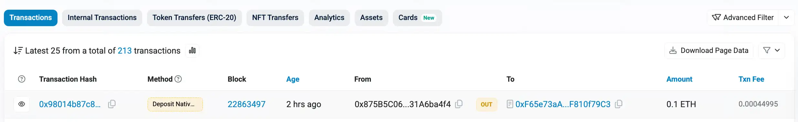
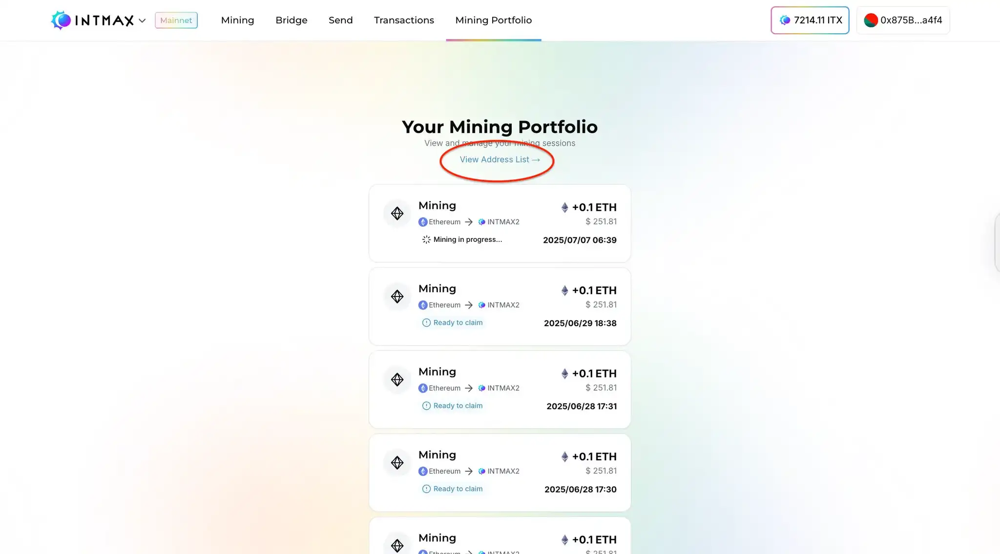
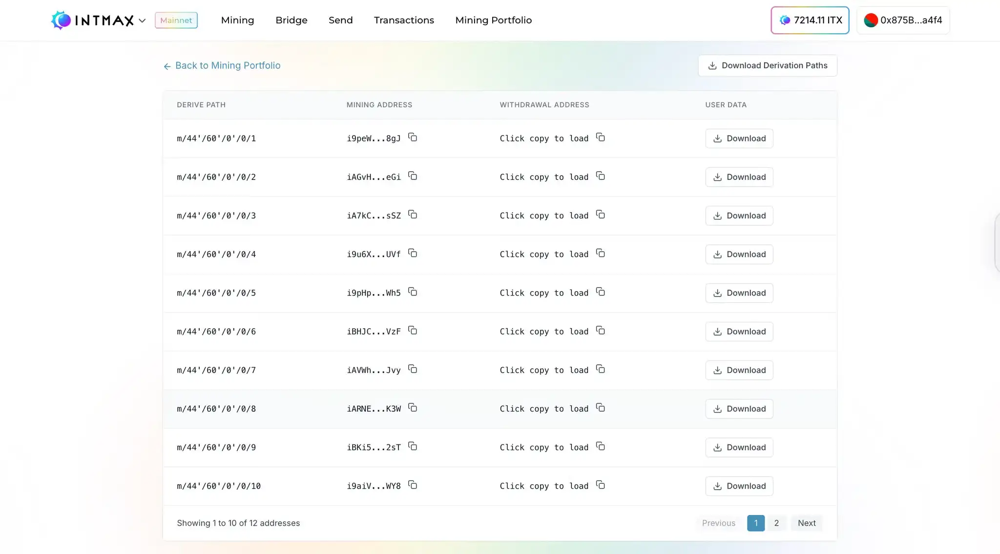

# 解決済みの問題

## マイニングポートフォリオに ETH の Deposit が表示されない

マイニングを通じて Deposit した ETH がポートフォリオ画面に正しく表示されない問題が発生していました。これは、Deposit アドレスがマイニング用のアドレスとして正しく認識されていなかったことが原因です。資金の損失や影響はありませんでした。
この問題は現在解決されています。Web サイトでウォレットを再接続していただくと、約 1 分以内にマイニングポートフォリオに Deposit した ETH が表示されます。
ご不便をおかけしたことをお詫び申し上げます。ご辛抱いただきありがとうございました。

### 確認手順

1. Etherscan でトランザクションが Ethereum 上で正常に実行されたかを確認します。

2. 接続中のアドレスで検索し、実行されたトランザクションの一覧を表示します。

3. 「Deposit Native Token」というラベルのトランザクションを見つけ、そのタイムスタンプがマイニング操作を行った時刻と一致するかを確認します。

トランザクションが実行されているにもかかわらず、1 時間経過してもマイニングポートフォリオに表示されない場合は、次の手順に進んでください。

### 復旧手順

アカウントを正常な状態に復旧するには、指定のページにアクセスし、自動復旧プロセスの完了を待ちます。以下の手順に従って、アドレスが正しく反映されていることを確認してください：

1. 以下のリンクから Web サイトにアクセスし、ウォレットを接続します。
   https://app.intmax.io/mining-portfolio
2. ウォレットの接続に成功したら、「View Address List」リンクをクリックしてください。

3. この画面に約 1 分間留まってください。このページにいる間、復旧処理が自動的に開始されます。

4. 一覧に表示されるアドレスの数が増えたことを確認し、更新が完了したことを確かめます。「Back to Mining Portfolio」リンクをクリックして、マイニングポートフォリオページに戻ってください。
