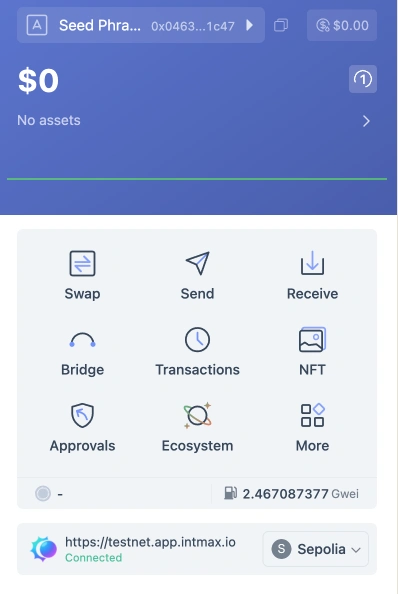
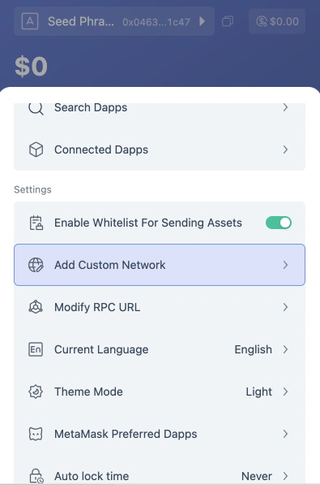
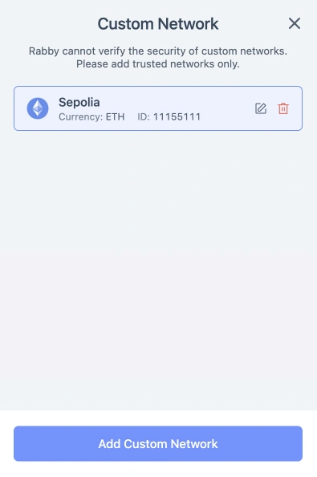
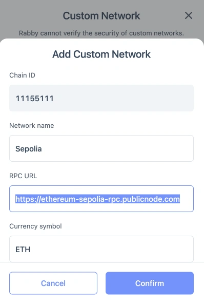

# Rabby Wallet

Rabby Wallet をダウンロードした直後の状態では、INTMAX Web アプリで使用できません。以下の手順で設定を変更してください。

1. 「More」>「Add custom network」を選択

  
  

2. Sepolia ネットワークを選択
3. https://chainlist.org/chain/11155111 を使用して Sepolia ネットワークを追加
4. RPC URL をコピー

  
  

