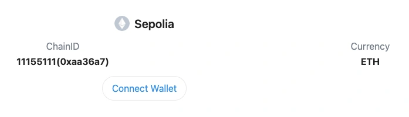
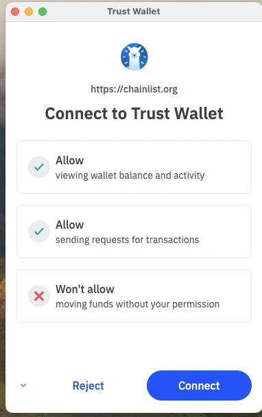

# Trust Wallet

Trust Wallet をダウンロードした直後の状態では、INTMAX Web アプリで使用できません。以下の手順でネットワーク設定を変更してください。


モバイルアプリはメインネットのみ対応しています。


1. Settings > Networks > Add custom network を選択
2. https://chainlist.org/chain/11155111 を使用して Sepolia ネットワークを追加
3. Connect Wallet ボタンをクリック

4. Trust Wallet 拡張機能に接続

