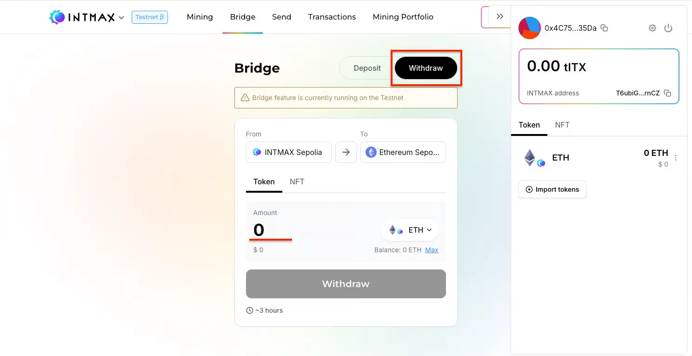
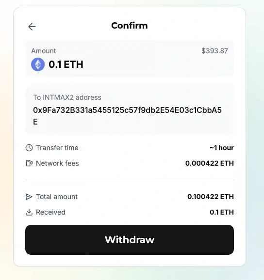
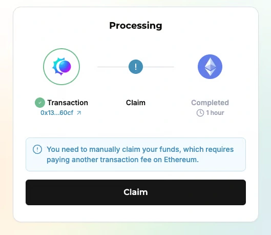
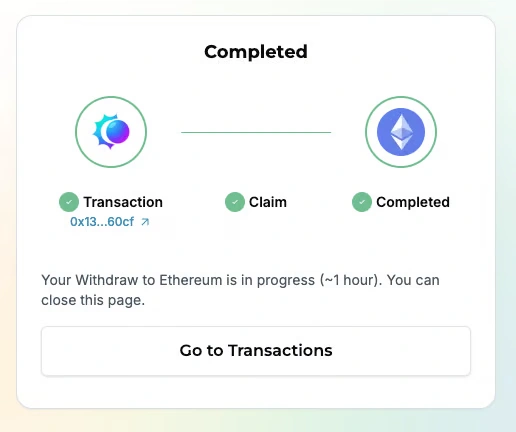

# INTMAX Network からの Withdrawal

INTMAX Network から Ethereum メインネットへ資産を移動できます。Withdrawal の際には、INTMAX Network 上の Transfer 手数料と Withdrawal 手数料が必要です。Withdrawal が反映されるまで約 6 時間かかります。

## 手順

1. **トークンの種類と金額を指定**

   Withdrawal するトークンの種類を選択し、金額を入力します。

2. **Withdrawal 先のアドレスを入力**

   トークンの送信先となる Ethereum アドレスを入力します。

3. **「Withdraw」をクリック**

   トークン、金額、アドレスを指定したら、「Withdraw」ボタンをクリックします。

4. **トランザクションの確認**

   確認ページで詳細を確認し、問題がなければ再度「Withdraw」ボタンをクリックして実行します。

5. **処理の完了を待つ**

   待機画面が表示されている間、トランザクションがスムーズに処理されるよう、最初の 2 分間はブラウザを閉じないでください。

### ETH・USDC・WBTC の Withdrawal

ETH、USDC、WBTC を Withdrawal する場合、指定した Withdrawal 先アドレスにトークンが自動的に届きます。

### その他のトークンの Withdrawal

ETH、USDC、WBTC 以外のトークンでは、Claim（請求）処理が必要です。このトランザクションを実行するには、Ethereum メインネット上にトークンが必要です。

  
  

